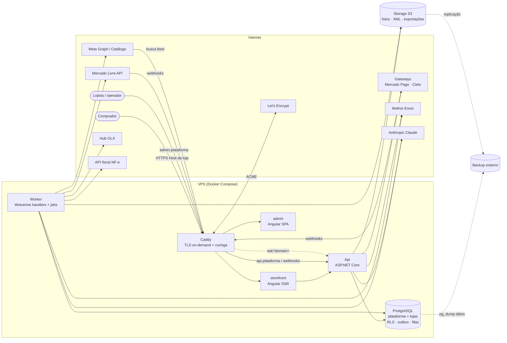
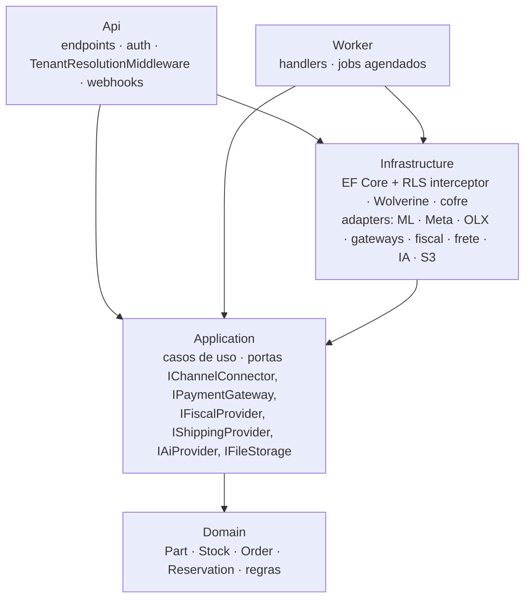
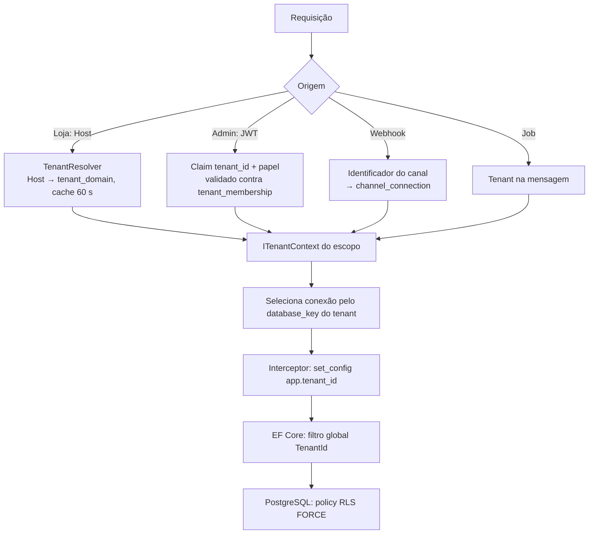
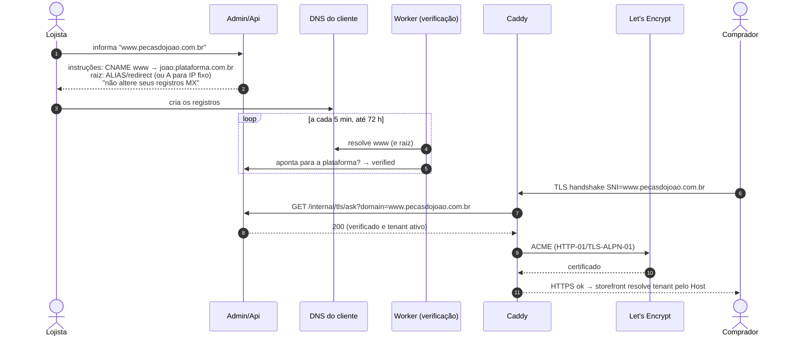

# Arquitetura

Decisões detalhadas em [docs/adr](adr/). Modelo de dados em [modelo-dados.md](modelo-dados.md).

## 1. Visão de componentes



### Camadas do back-end (Clean Architecture)



## 2. Fluxo ponta a ponta: venda no Mercado Livre

Peça usada, quantidade 1, anunciada no ML, no Instagram e na loja.

```mermaid
sequenceDiagram
    autonumber
    participant ML as Mercado Livre
    participant C as Caddy
    participant API as Api
    participant DB as PostgreSQL
    participant W as Worker
    participant META as Meta Catalog
    participant OLX as Hub OLX
    participant NF as API fiscal

    ML->>C: POST /webhooks/mercadolivre {topic: orders_v2, resource, user_id}
    C->>API: encaminha
    API->>DB: INSERT inbox.external_event (UNIQUE source+chave)
    alt chave já existe (webhook repetido)
        API-->>ML: 200 OK (nada mais acontece)
    else novo
        API->>DB: enfileira ProcessMlNotification (fila durável)
        API-->>ML: 200 OK imediato
    end

    W->>DB: resolve tenant por channel_connection.external_account_id = user_id
    W->>W: abre escopo do tenant (app.tenant_id)
    W->>ML: GET /orders/{id} (token do tenant, via cofre)
    ML-->>W: pedido pago, item MLB123 x1

    W->>DB: BEGIN
    W->>DB: INSERT customer_order (UNIQUE tenant+origem+external_id)
    W->>DB: UPDATE stock SET on_hand = on_hand - 1 WHERE part_id AND on_hand - reserved >= 1
    alt 1 linha afetada
        W->>DB: INSERT stock_movement + outbox StockChanged(part, available=0)
    else 0 linhas (já vendida no site/balcão)
        W->>DB: pedido status = stock_conflict + alerta ao lojista (Q01)
    end
    W->>DB: COMMIT

    par Propagação (≤ 60 s, meta ≤ 10 s)
        W->>META: items_batch: availability = out of stock
        W->>OLX: pausa anúncio
        W->>DB: anúncio do ML: canal já zerou sozinho, só registra
        W->>DB: integration_log por operação
    end

    Note over W: falha → retentativa com backoff → dead letter + alerta (RF28)

    W->>NF: emitir NF-e (manual na E1; automática depois)
    NF-->>W: autorizada (via webhook/consulta)
    W->>DB: fiscal_document + XML/DANFE no S3
    W->>ML: anexa NF ao pedido, se aplicável
```

Pontos de garantia:
- **Idempotência** em três níveis: `inbox.external_event` (webhook), `UNIQUE (tenant_id, origin, external_id)` no pedido e handlers que verificam o estado antes de agir.
- **Sem venda dupla:** a baixa é um único `UPDATE` condicional; o caso "vendeu em dois canais na mesma janela" vira `stock_conflict` explícito, nunca saldo negativo.
- **Reconciliação horária** (RF27) corrige qualquer anúncio que tenha ficado divergente.

## 3. Estratégia multi-tenant

Resumo do [ADR-0001](adr/0001-isolamento-multi-tenant.md):



- **Duas barreiras independentes:** filtro do EF e RLS. A ausência de tenant **falha fechada** (zero linhas).
- **Papéis:** `app_user` (sem BYPASSRLS), `app_migrator` (dono), `app_platform` (catálogo/superadmin, auditado).
- **Escala:** tenant grande muda o `database_key` para um banco próprio; o código não muda.
- **Configuração por tenant**, nunca código: tema, textos, gateway, frete, canais e recursos do plano (feature flags lidas de `plan_feature`).

## 4. Domínio próprio

Resumo do [ADR-0004](adr/0004-proxy-ssl-dominios.md):



- Subdomínios `*.plataforma.com.br` usam **um certificado curinga** (DNS-01), evitando o limite de 50 certificados/domínio/semana do Let's Encrypt.
- O endpoint `ask` responde 404 para domínio desconhecido, não verificado ou de tenant suspenso — ninguém consegue forçar emissão de certificados arbitrários.
- Domínio removido sai do `ask` na hora; o certificado expira naturalmente.

## 5. Implantação inicial (VPS 4 vCPU / 8 GB)

| Container | Memória estimada |
|---|---|
| PostgreSQL | 2–3 GB (shared_buffers ~1,5 GB) |
| Api | 300–500 MB |
| Worker | 300–500 MB |
| storefront (Node SSR) | 200–300 MB |
| Caddy | ~50 MB |
| admin | estático servido pelo Caddy |

Fotos fora da VPS (S3). Observabilidade: logs JSON (Serilog) + health checks; métricas OpenTelemetry com exportador a definir na E1 (ex.: Grafana Cloud no plano gratuito).
