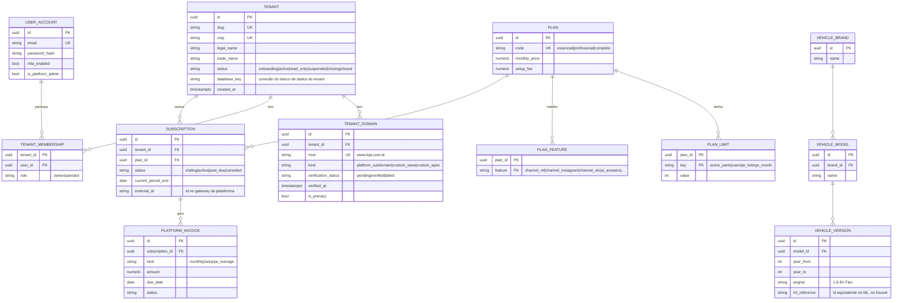
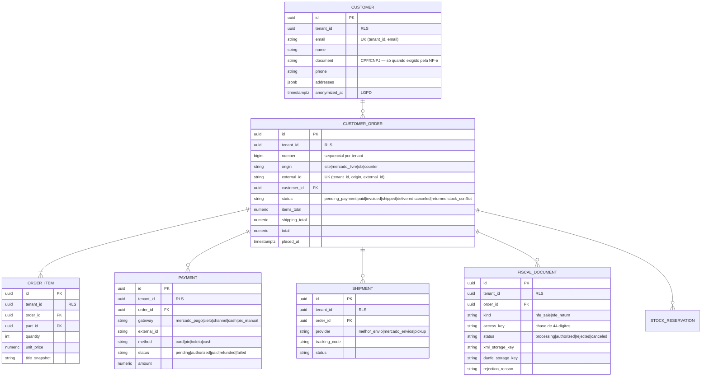

# Modelo de dados

Base: [ADR-0001](adr/0001-isolamento-multi-tenant.md). Nomes físicos em `snake_case`; ids `uuid` v7; datas `timestamptz` UTC; dinheiro `numeric(12,2)`.

## Dois bancos lógicos

| Banco | Conteúdo | RLS | Quem acessa |
|---|---|---|---|
| **`plataforma`** (catálogo) | tenants, domínios, identidade de usuários e vínculos, planos, assinaturas, cobrança da plataforma, catálogo de veículos (fonte) | Não — dados da plataforma | API (resolução de tenant, login), superadmin |
| **`lojas`** (dados de tenant) | tudo que pertence a uma loja | **Sim**, em toda tabela com `tenant_id` | API e Worker com `app_user` |

Um tenant grande pode ter seu próprio banco `lojas_<slug>` (RNF08): `tenant.database_key` aponta para a conexão. Por isso **não há chave estrangeira entre os bancos**; referências cruzadas são ids validados pela aplicação.

Tabelas de referência globais (veículos, categorias de referência) são **replicadas** do banco `plataforma` para o schema `ref` de cada banco `lojas` por job de sincronização — assim `part_compatibility` pode ter FK local para `ref.vehicle_version`.

## Banco `plataforma`



Notas:
- Identidade fica no catálogo porque o login acontece **antes** de sabermos o tenant; um e-mail pode participar de mais de um tenant.
- `PLATFORM_AUDIT_LOG` (não desenhado) registra ações de superadmin (RF07 CA3).
- Implementado no RF07 (E1): `user_account` com `failed_login_count`, `locked_until` e `must_change_password` (sem `mfa_enabled`/`is_platform_admin` até o E4); `tenant.plan_code` → `plan.code` (plano vigente até existir `subscription`); `plan_limit` chaveado por `(plan_code, key)`; `refresh_token` (só o hash SHA-256, `family_id` para revogar a sessão inteira, `tenant_id` da loja escolhida, `used_at`/`revoked_at`). Tabelas com `tenant_id` neste banco não têm RLS: todo acesso filtra o tenant explicitamente e tem teste de isolamento.

## Banco `lojas` — todas as tabelas abaixo têm `tenant_id` + RLS

### Catálogo e estoque

```mermaid
erDiagram
    PART ||--o{ PART_PHOTO : ""
    PART ||--o{ PART_OEM_CODE : ""
    PART ||--o{ PART_COMPATIBILITY : ""
    PART ||--o| PART_TRACEABILITY : "peça usada"
    PART ||--|| STOCK : ""
    PART ||--o{ STOCK_RESERVATION : ""
    PART ||--o{ STOCK_MOVEMENT : ""
    PART ||--o{ CHANNEL_LISTING : "anunciada em"
    CHANNEL_CONNECTION ||--o{ CHANNEL_LISTING : ""
    REF_VEHICLE_VERSION ||--o{ PART_COMPATIBILITY : ""

    PART {
        uuid id PK
        uuid tenant_id "RLS"
        string internal_code "UK (tenant_id, internal_code)"
        string title
        text description
        string condition "new|used|refurbished"
        numeric price
        int weight_g "embalagem; nulo = não informado"
        int length_cm
        int width_cm
        int height_cm
        string status "draft|active|inactive (sem exclusão)"
        jsonb fiscal "ncm, cfop, cst_csosn, origem"
        jsonb extra_attributes "atributos do ML etc."
        bool ai_generated_pending_review
        tsvector search_vector
    }
    STOCK {
        uuid part_id PK
        uuid tenant_id "RLS"
        int on_hand "CHECK >= 0"
        int reserved "CHECK >= 0 AND reserved <= on_hand"
        int available "GENERATED on_hand - reserved"
        bigint version
    }
    STOCK_RESERVATION {
        uuid id PK
        uuid tenant_id "RLS"
        uuid part_id FK
        uuid order_id FK
        int quantity
        string status "active|converted|expired|released"
        timestamptz expires_at
    }
    STOCK_MOVEMENT {
        uuid id PK
        uuid tenant_id "RLS"
        uuid part_id FK
        int delta
        string reason "sale|counter_sale|cancel|return|adjust|import|reconcile"
        uuid order_id "nullable"
        uuid user_id "nullable"
        timestamptz at
    }
    PART_PHOTO {
        uuid id PK "também é a chave dos arquivos no storage"
        uuid tenant_id "RLS"
        uuid part_id FK
        int position "0 = capa; 0..19"
        string original_content_type
        timestamptz created_at
    }
    PART_OEM_CODE {
        uuid tenant_id "RLS"
        uuid part_id PK
        string code PK "só letras e dígitos, maiúsculo"
    }
    PART_COMPATIBILITY {
        uuid id PK
        uuid tenant_id "RLS"
        uuid part_id FK
        uuid vehicle_version_id FK
        string source "manual|ai_suggested|ml_import"
        bool confirmed
    }
    PART_TRACEABILITY {
        uuid part_id PK
        uuid tenant_id "RLS"
        string donor_plate_partial
        string donor_chassis_partial
        string donor_renavam
        string deregistration_certificate "certidão de baixa"
        string entry_invoice_key "chave NF de entrada"
        jsonb custom_fields
    }
    CHANNEL_CONNECTION {
        uuid id PK
        uuid tenant_id "RLS"
        string channel "mercado_livre|meta|olx"
        string external_account_id "user_id do vendedor no ML"
        string status "active|reauth_required|disabled"
        uuid secret_id FK "tokens no cofre"
    }
    CHANNEL_LISTING {
        uuid id PK
        uuid tenant_id "RLS"
        uuid part_id FK
        uuid connection_id FK
        string external_id "MLB123..."
        string status "pending|active|paused_by_system|paused_by_user|closed|error"
        int last_pushed_quantity
        numeric last_pushed_price
        timestamptz last_synced_at
    }
    REF_VEHICLE_VERSION {
        uuid id PK "réplica de plataforma.vehicle_version"
    }
```



**Regra de estoque (RNF02):** reserva e baixa são um único `UPDATE` condicional:
```sql
UPDATE stock SET reserved = reserved + @qty, version = version + 1
WHERE part_id = @part AND on_hand - reserved >= @qty;   -- 0 linhas = sem saldo
```
As `CHECK` constraints são a última barreira contra saldo negativo.

### Pedidos, pagamento e fiscal



### Integração, IA, segurança e operação

```mermaid
erDiagram
    EXTERNAL_EVENT {
        uuid id PK
        uuid tenant_id "RLS (nullable até resolver o tenant — ver nota)"
        string source "mercado_livre|mercado_pago|cielo|meta|olx_hub|fiscal"
        string idempotency_key "UK (source, idempotency_key)"
        jsonb payload
        string status "received|processed|ignored|failed"
        timestamptz received_at
    }
    INTEGRATION_LOG {
        uuid id PK
        uuid tenant_id "RLS"
        string channel
        string operation "publish|update|pause|resume|reconcile|webhook"
        uuid part_id "nullable"
        uuid order_id "nullable"
        string status "ok|error|retrying"
        int duration_ms
        string error_summary "sem segredos"
        string correlation_id
        timestamptz at
    }
    TENANT_SECRET {
        uuid id PK
        uuid tenant_id "RLS"
        string kind "gateway_key|a1_certificate|oauth_token|..."
        bytea ciphertext
        bytea wrapped_data_key
        string key_version
        string hint "últimos 4 caracteres"
        timestamptz expires_at
    }
    BUYER_QUESTION {
        uuid id PK
        uuid tenant_id "RLS"
        string channel
        string external_id
        uuid part_id
        text question
        text answer
        string status "pending|draft_ready|answered_auto|answered_human"
    }
    AI_INTERACTION {
        uuid id PK
        uuid tenant_id "RLS"
        uuid user_id "nullable"
        string feature "part_from_photos|buyer_answer|daily_summary|sync_diagnosis|price_suggestion"
        string model
        int input_tokens
        int output_tokens
        numeric estimated_cost
        jsonb input_summary
        jsonb output
        timestamptz at
    }
    AI_USAGE_COUNTER {
        uuid tenant_id PK
        string feature PK
        date period PK "primeiro dia do mês"
        int used
    }
    STORE_BRANDING {
        uuid tenant_id PK
        string primary_color "#RRGGBB"
        string background_color
        string text_color
        string about "texto institucional"
        string return_policy "trocas e devoluções"
        string footer
        timestamptz updated_at
    }
    STORE_SETTINGS {
        uuid tenant_id PK
        int reservation_minutes "padrão 30"
        jsonb shipping "CEP origem, retirada"
        jsonb payment "gateway escolhido"
    }
    ACCESS_LOG {
        uuid id PK
        uuid tenant_id "RLS"
        uuid user_id
        string action "LGPD: acesso a dado pessoal"
        string subject
        timestamptz at
    }
```



**Nota sobre `EXTERNAL_EVENT`:** o webhook chega antes de sabermos o tenant (ex.: ML identifica o vendedor por `user_id`). O endpoint grava o evento numa tabela de **entrada** sem RLS no schema `inbox` (só `INSERT` para `app_user`), resolve o tenant por `channel_connection.external_account_id` e enfileira o processamento já no escopo do tenant. A tabela com RLS guarda o evento depois de associado.

## Onde está o `tenant_id` — resumo

| Local | `tenant_id` | RLS |
|---|---|---|
| `plataforma.*` | Coluna em `tenant_domain`, `tenant_membership`, `subscription` | Não (acesso só pela API/superadmin) |
| `lojas.public.*` (negócio) | **Obrigatório, NOT NULL**, primeiro campo de todo índice | **Sim**, `FORCE` |
| `lojas.ref.*` (veículos, categorias) | Não tem | Não; somente leitura para `app_user` |
| `lojas.inbox.*` (webhooks crus) | Não tem | Não; `app_user` só `INSERT`/leitura pelo Worker de roteamento |
| `lojas.wolverine.*` (fila/outbox) | Dentro da mensagem | Não |
